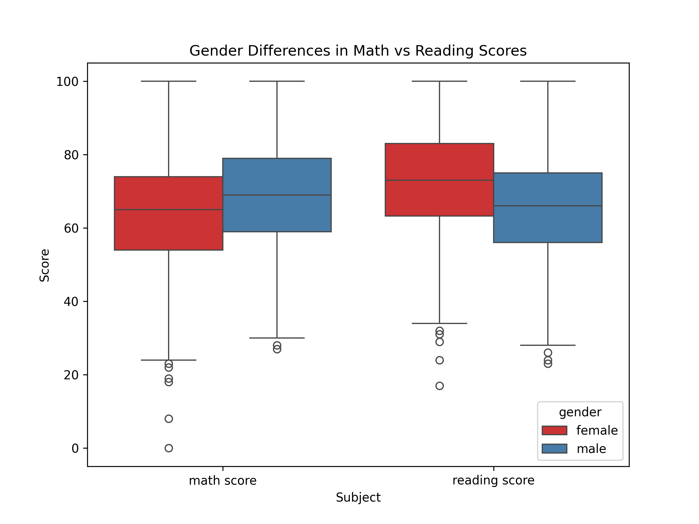
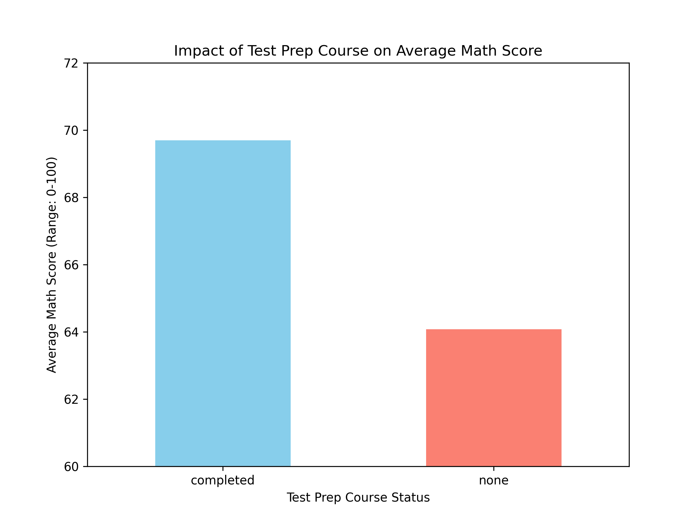
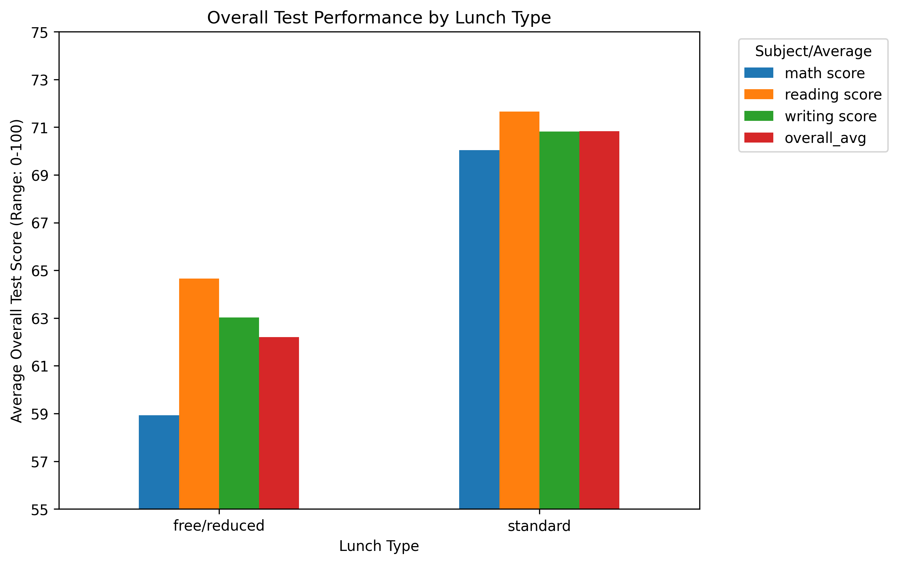
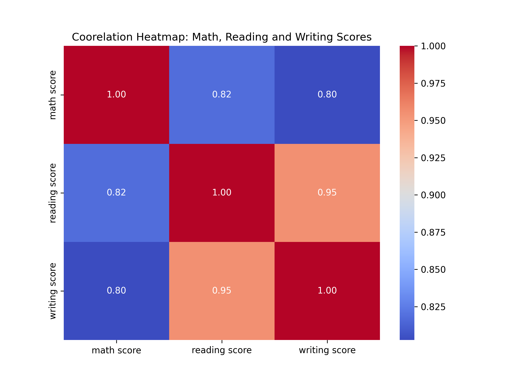
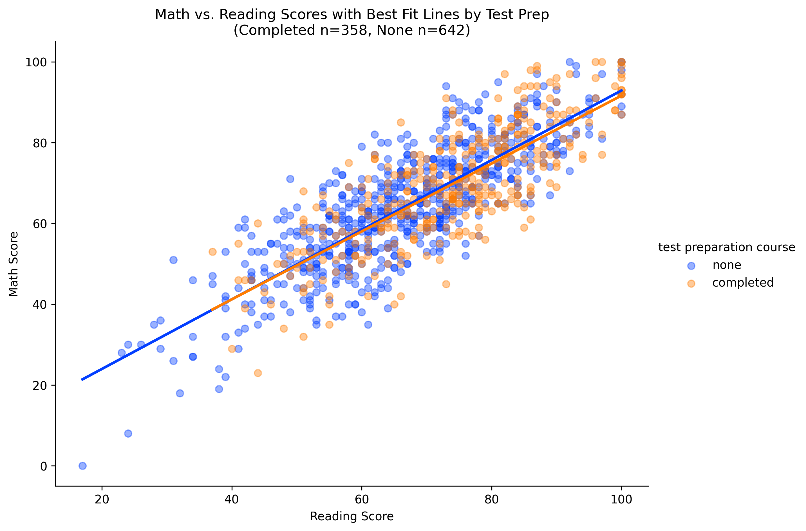

# Analysis Report

## V1 - Gender boxplots (math vs reading)

The boxplot compares gender differences in Math vs Reading scores. For the math scores, on average, male students tend to score better than female students. On the reader score side, the female students tend to score better than the male students. The inner quartile ranges are the same for both math and reading scores for both male and female students, showing that the spread of performance is consistent. There are more outliers below for both female and male students on both scores, which shows that there's a good number of students who may need more help with both subjects.

---

## V2: Impact of Test Preparation Course

The bar chart compares the average math score of the students who completed vs not complete the test preparation. Students in the completed group achieved a higher average math score compared to the students who did not take the test preparation course. On the y-axis, I chose to bring the range from 60 to 72 with a tick for every 2 units. This shows a closer difference between the completed and non-completed for the test preparation course.

---

## V3: Lunch Type and Overall Performance

The grouped bar chart indicates the higher leaning end of higher average test scores for the students who receive the standard lunch type. For free/reduced lunch there's a significant difference of the average scores between the math, reading, writing, and overall average. For both lunch types, the reading score tends to be higher than the rest of the scores and the math score tends to be the lower end of the rest of the scores. For the overall average for both there's about a 10 point gap in between the two of them. This suggests that the socioeconomic status is truly represented by lunch eligibility with their academic readiness. This chart overall confirms that success is related to/is a big predictor by lunch type.

---

## V4: Subject Correlations

This heat map correlation shows the 3 subjects and how they relate to one another. The subjects all show high correlation with each other with over 0.8 for all. This indicates that they rely on each other, more specifically reading and writing rely on each other with the 0.95 correlation. This is justified since you need simple reading and writing knowledge for both subjects. Math and reading have a high coorelation of 0.82 which indicates the need to read math problems and equations. The high correlations show that students who score high in one area can score high in the rest. This suggests that there's a consistency in the academic skills and habits upon how they prepare for these courses overall.

---

## V5: Math vs. Reading Trends by Test Prep

This scatterplot shows the strong relationship with reading and math scores. Showing that as the reading scores went up so did the math scores. There's a consistent trend for both the none and completed of the test prep course. The y axis start for students who completed the test prep starts higher on the y axis showing that there's a higher math score intercept. Where the y intercept for the students who did not complete the test preparation course have about 20 points less than the start of the students who did complete. This shows that the test preparation can help in many ways to improve performance, it isn't necessarily needed considering there's an association between the 2 scores.
